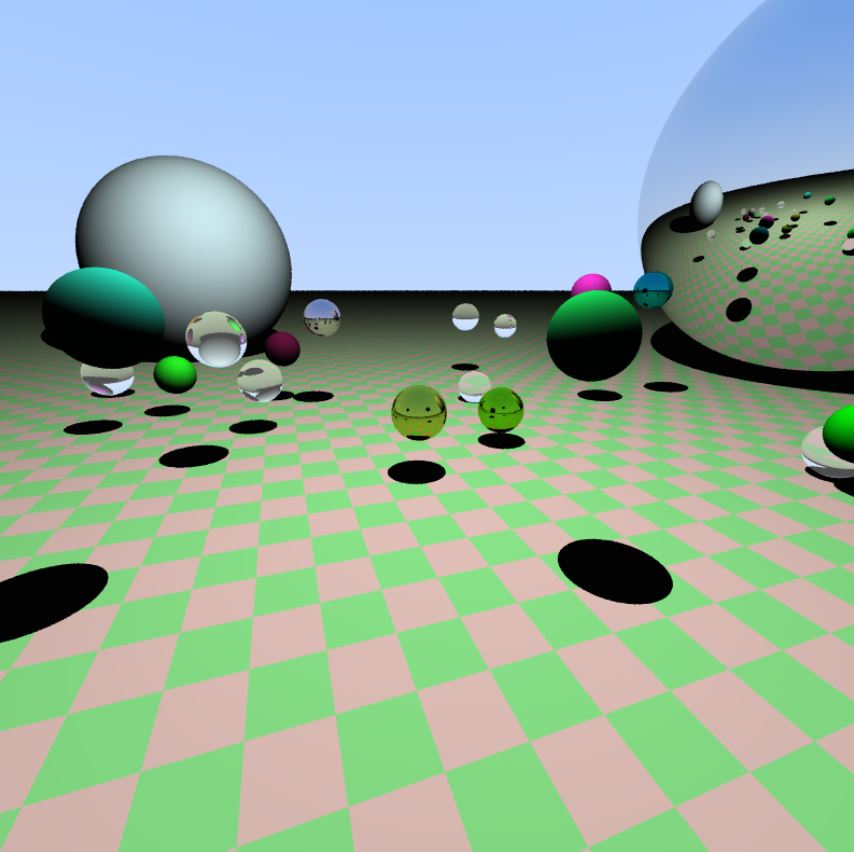

# WebGL Ray Tracer

This GitHub repository is my code for a Ray Tracer in Javascript and WebGL. I solo developed this for my final project for the graduate version of CS 418: Interactive Computer Graphics. 

The script in action can be found <a href="https://caseyrodgers.online/custom_files/cs418_ray_tracer/mp4cred.html" target="_blank">here</a>.

The code creates 35 spheres of random size, material, and color floating at different positions in a static scene. Each time the code is ran (aka the webpage refreshed), most of the spheres are completely changed since their properties are random. The three possible material types are: diffuse, metal (reflection), and dielectric (refraction).

Additionally, a bounding volume hierarchy was implemented to improve performance. The bounding volume hierarchy is initially set up in Javascript and then sent to the fragment shader as a 2D texture. There, the bounding volume hierarchy can be accessed to check if a bounding volume has been hit.

An example screenshot of the final image can be found below.

I used the famous <a href="https://raytracing.github.io/" target="_blank">Ray Tracing in One Weekend - The Book Series</a> as well as <a href="https://github.com/sschoenholz/WebGL-Raytracer" target="_blank">sschoenholz's WebGL Ray Tracer</a> as references for this project.